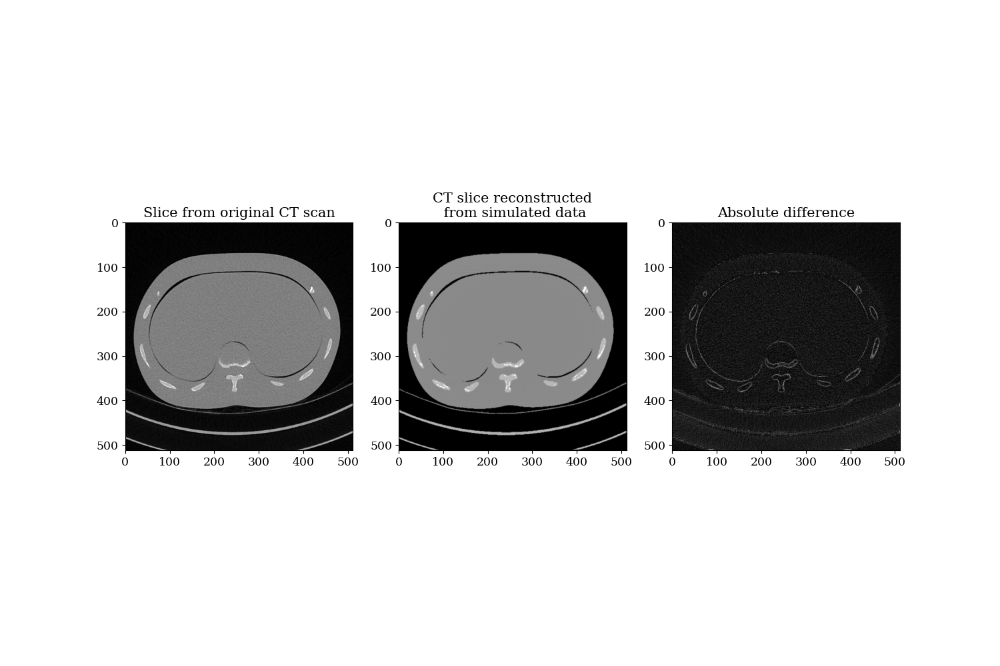
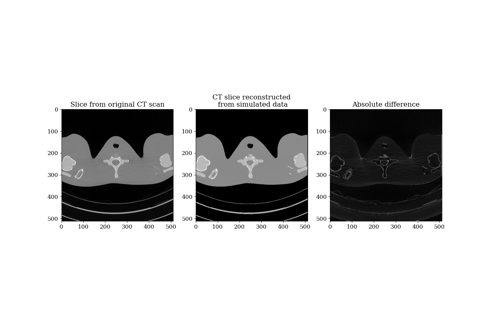

# gvxr-CMPB

**Simulation of X-ray projections on GPU: benchmarking gVirtualXray with clinically realistic phantoms**

Jamie Lea Pointon<sup>a</sup>, Tianci Wen<sup>a</sup>, Jenna Tugwell-Allsup<sup>b</sup>, Aaron S&uacute;jar<sup>c,a</sup>, Jean Michel Létang<sup>d</sup>, Franck Patrick Vidal<sup>a,*</sup>

<i><sup>a</sup> School of Computer Science &amp; Electronic Engineering, Bangor University, UK</i>
<i><sup>b</sup> Radiology Department, Betsi Cadwaladr University Health Board (BCUHB), North Wales, Ysbyty Gwynedd, UK</i>
<i><sup>c</sup> Department of Computer Science, Universidad Rey Juan Carlos, Mostoles, Spain</i>
<i><sup>d</sup> Univ Lyon, INSA-Lyon, Université Claude Bernard Lyon 1, UJM-Saint &Eacute;tienne, CNRS, Inserm, CREATIS UMR 5220, U1294, F-69373, LYON, France</i>
<i><sup>*</sup> Corresponding author</i>

Submitted to Computer Methods and Programs in Biomedicine

## Abstract

*Background and Objectives:* This study provides a quantitative comparison of images created using gVirtualXray (gVXR) to both Monte Carlo (MC) and real images of clinically realistic phantoms. gVirtualXray is an open-source framework that relies on the Beer-Lambert law to simulate X-ray images in realtime on a graphics processor unit (GPU) using triangular meshes.

*Methods:* Images are generated with gVirtualXray and compared with a corresponding ground truth image of an anthropomorphic phantom: (i) an X-ray projection generated using a Monte Carlo simulation code, (ii) real digitally reconstructed radiographs (DRRs), (iii) computed tomography (CT) slices, and (iv) a real radiograph acquired with a clinical X-ray imaging system. When real images are involved, the simulations are used in an image registration framework so that the two images are aligned.

*Results:* The mean absolute percentage error (MAPE) between the images simulated with gVirtualXray and MC is 3.12%, the zero-mean normalised cross-correlation (ZNCC) is 99.96% and the structural similarity index (SSIM) is 0.99. The run-time is 10 days for MC and 23 msec with gVirtualXray. Images simulated using surface models segmented from a CT scan of the Lungman chest phantom were similar to i) DRRs computed from the CT volume and ii) an actual digital radiograph. CT slices reconstructed from images simulated with gVirtualXray were comparable to the corresponding slices of the original CT volume.

*Conclusions:* When scattering can be ignored, accurate images that would take days using MC can be generated in milliseconds with gVirtualXray. This speed of execution enables the use of repetitive simulations with varying parameters, e.g. to generate training data for a deep-learning algorithm, and to minimise the objective function of an optimisation problem in image registration. The use of surface models enables the combination of X-ray simulation with real-time soft-tissue deformation and character animation, which can be deployed in virtual reality applications.

## Keywords

 X-rays; Computed tomography; Simulation; Monte Carlo; GPU programming; Image registration; DRR

## Highlights

- Realistic X-ray simulation from anatomical data
- Registration of simulated X-ray images on real radiographs
- Validation and benchmarking using Monte Carlo simulation, real radiographs and DRRs
- Superior computational performance for VR and high-throughput data applications

## Content

- [environment.yml](environment.yml): Conda environment file.
- [1-gVirtualXRay_vs_Gate-detector_realistic_phantom.ipynb](1-gVirtualXRay_vs_Gate-detector_realistic_phantom.ipynb):


MAPE: 3.12%, ZNCC: 99.96%, and SSIM: 0.99

In this notebook, we aim to demonstrate that gVirtualXRay is able to generate analytic simulations on GPU comparable to images generated with the state-of-the-art Monte Caro simulation packages. An anthropomorphic phantom is used. It corresponds to a 5-year old boy. We take into account i) a realistic beam spectrum (tube voltage and filtration) and ii) the energy response of the detector.
- [2-gVirtualXRay_vs_DRRs-Lungman.ipynb](2-gVirtualXRay_vs_DRRs-Lungman.ipynb):


MAPE: 1.76%, ZNCC: 99.66%, SSIM: 0.98


MAPE: 2.43%, ZNCC: 99.31%, SSIM: 0.93.

In this notebook, we aim to demonstrate that gVirtualXRay is able to generate analytic simulations on GPU comparable to digitally reconstructed radiographs (DRRs) of a real CT scan computed with [Plastimatch](https://plastimatch.org/). For this experiment, we attempt to recreate a X-ray projections of the [Lungman chest phantom](https://www.kyotokagaku.com/en/products_data/ph-1_01/) with gVirtualXRay.
- [3-gVirtualXRay_vs_CT-Lungman.ipynb](3-gVirtualXRay_vs_CT-Lungman.ipynb):


MAPE: 5.50%, ZNCC: 98.96%, SSIM: 0.62


MAPE: 5.01%, ZNCC: 98.44%, SSIM: 0.78


MAPE: 4.46%, ZNCC: 99.05%, SSIM: 0.82

In this notebook, we demonstrate how to gVirtualXray can be used to generate CT data from polygon meshes. For this experiment, we attempt to recreate a CT volume from X-ray projections of the [Lungman chest phantom](https://www.kyotokagaku.com/en/products_data/ph-1_01/) simulated with gVirtualXRay. The CT volume is reconstructed with the [Core Imaging Library (CIL)](https://ccpi.ac.uk/cil/).
- [4-gVirtualXRay_vs_DR-Lungman.ipynb](4-gVirtualXRay_vs_DR-Lungman.ipynb):


MAPE: 1.56%, ZNCC: 98.91%, and SSIM: 0.94.

We aim to reproduce a real digital radiograph taken with a clinically utilised X-ray equipment.
- [notebook-1.json](notebook-1.json): JSON file used to set the simulation in  [1-gVirtualXRay_vs_Gate-detector_realistic_phantom.ipynb](1-gVirtualXRay_vs_Gate-detector_realistic_phantom.ipynb).
- [notebook-2.json](notebook-2.json): JSON file used to set the simulation in  [2-gVirtualXRay_vs_DRRs-Lungman.ipynb](2-gVirtualXRay_vs_DRRs-Lungman.ipynb).
- [notebook-3.json](notebook-3.json): JSON file used to set the simulation in  [3-gVirtualXRay_vs_CT-Lungman.ipynb](3-gVirtualXRay_vs_CT-Lungman.ipynb).
- [notebook-4.json](notebook-4.json): JSON file used to set the simulation in  [4-gVirtualXRay_vs_DR-Lungman.ipynb](4-gVirtualXRay_vs_DR-Lungman.ipynb).
- [convertRaw.py](convertRaw.py): Python file to read a raw binary file and convert it into a [SimpleITK](https://simpleitk.org/) image.
- [sitk2vtk.py](sitk2vtk.py): Python file to read an image with [SimpleITK](https://simpleitk.org/) and convert it into a [VTK](https://www.vtk.org/) image.
- [utils.py](utils.py): Python file with a few functions developed for this study (mostly to generate the plots in a consistent manner).
- [1-output_data](1-output_data): Directory that stores the files created with [1-gVirtualXRay_vs_Gate-detector_realistic_phantom.ipynb](1-gVirtualXRay_vs_Gate-detector_realistic_phantom.ipynb).
- [2-output_data](2-output_data): Directory that stores the files created with [2-gVirtualXRay_vs_DRRs-Lungman.ipynb](2-gVirtualXRay_vs_DRRs-Lungman.ipynb).
- [3-output_data](3-output_data): Directory that stores the files created with [3-gVirtualXRay_vs_CT-Lungman.ipynb](3-gVirtualXRay_vs_CT-Lungman.ipynb).
- [4-output_data](4-output_data): Directory that stores the files created with [4-gVirtualXRay_vs_DR-Lungman.ipynb](4-gVirtualXRay_vs_DR-Lungman.ipynb).
- [doc](doc): Some diagrams.
- [lungman_data](lungman_data): Directory that contains files related to the Lungman phantom.
- [PDFs](PDFs): Directory that contains the Jupyter notebooks saved as PDF files.
- [pediatric_phantom_data](pediatric_phantom_data): Directory that contains files related to the pediatric phantom.
- [PediatricGate](PediatricGate): Directory that contains files related to the Monte Carlo simulation of pediatric phantom.

## Requirements

You must install Conda. See [https://conda.io/projects/conda/en/latest/user-guide/install/index.html](https://conda.io/projects/conda/en/latest/user-guide/install/index.html) for more information.


## Installation

```bash
conda  env create -f environment.yml
```

## Related software projects

- [gVirtualXray (gVXR)](http://gvirtualxray.sourceforge.io/) provides a programming framework for simulating X-ray images on the graphics processor unit (GPU) using OpenGL. In a nutshell, it computes the polychromatic version of the Beer-Lambert law (the mathematical model that relates the attenuation of X-ray photons to the properties of the material through which the photons are travelling) on the graphics card from polygon meshes.
- [xraylib](https://github.com/tschoonj/xraylib) provides the mass attenuation coefficients used by gVXR.
- The [Core Imaging Library (CIL)](https://ccpi.ac.uk/cil/) is an open-source mainly Python framework for tomographic imaging for cone and parallel beam geometries. It comes with tools for loading, preprocessing, reconstructing and visualising tomographic data.
- [SpekPy](https://bitbucket.org/spekpy/spekpy_release/wiki/Home) is a free software toolkit for calculating and manipulating x-ray tube spectra.
- [Gate](http://www.opengatecollaboration.org/) is an open-source software dedicated to numerical simulations in medical imaging and radiotherapy based on [Geant4](https://geant4.web.cern.ch/), the general-purpose Monte Carlo (MC) code by the European Organization for Nuclear Research (CERN).
- [SimpleITK](https://simpleitk.org/) is an open-source multi-dimensional image analysis in Python, R, Java, C#, Lua, Ruby, TCL and C++. Developed by the [Insight Toolkit](https://www.itk.org/) community for the biomedical sciences and beyond.
- The [Visualization Toolkit (VTK)](http://www.vtk.org/)  is open source software for manipulating and displaying scientific data. It comes with state-of-the-art tools for 3D rendering, a suite of widgets for 3D interaction, and extensive 2D plotting capability.

## References

- Vidal F.P., Villard P.F. Development and validation of real-time simulation of X-ray imaging with respiratory motion. [Comput Med Imaging Graph](https://www.sciencedirect.com/journal/computerized-medical-imaging-and-graphics). 2016 Apr;49:1-15. doi: [10.1016/j.compmedimag.2015.12.002](https://doi.org/10.1016/j.compmedimag.2015.12.002). Epub 2015 Dec 17. PMID: [26773644](https://pubmed.ncbi.nlm.nih.gov/26773644/).
